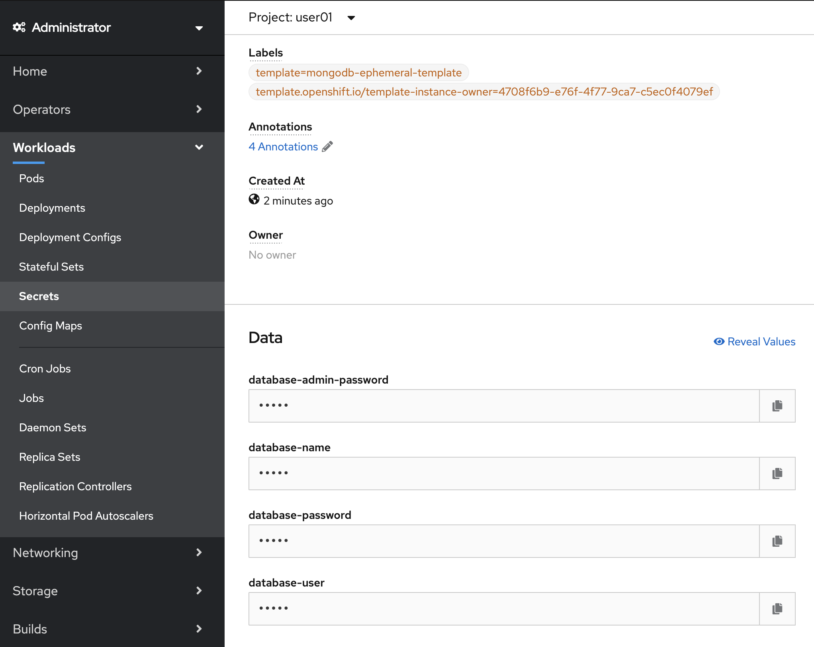
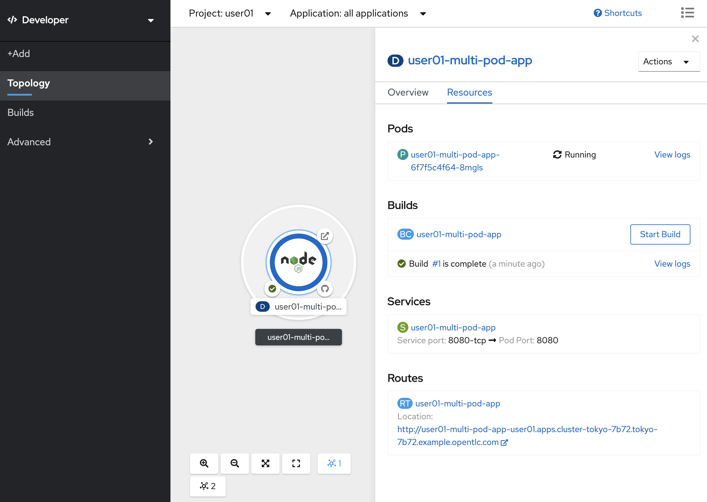
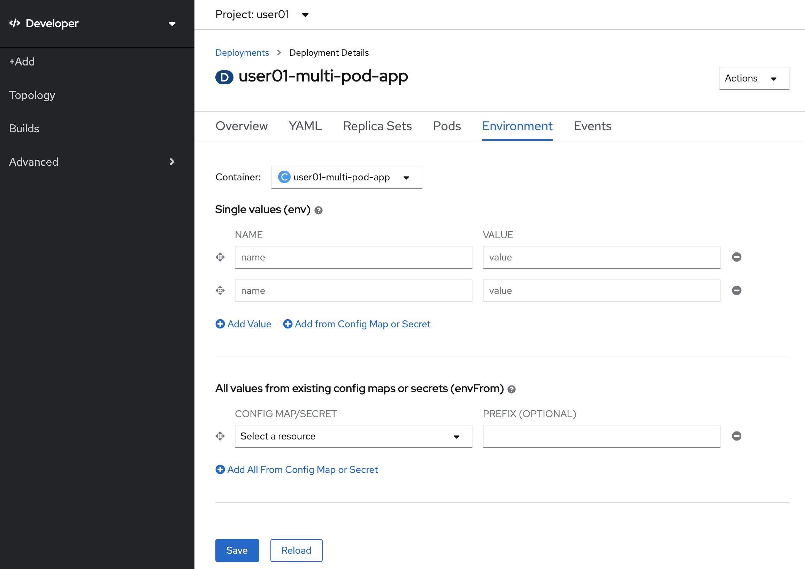

# Lab3: 複数コンテナの連携

- テンプレートからMongoDBを構築
- テンプレートからNode.jsアプリケーションを作成
- Node.jsアプリケーションのsecretを設定し、MongoDBと繋げる

# MongoDBを構築
Node.jsアプリケーションを作成し、MongoDBと接続する上で必要な情報を設定し連携させます。まずはMongoDBから構築していきます。

1. プロジェクトを選択します

    プロジェクトは，**必ずご自身のログイン時のユーザー名 (例: "user01")** のものを選択してください。
    Home > Project > user01　 (例)

    

1. +Add > From Catalog > と選択し、「mongodb (ephemeral)」と検索し、MongoDB(Ephemeral)を選択してください。

    

1. Instantiate Templateをクリックしたら下記のような画面になります。そのまま下部のCreateをクリックしてください。
  
    

1. Administrator コンソールに切り替えてください。切り替えたら左側のMenuから Workloads > Secretsと進み、mongodbを選択してください。

    

1. 右下のReveal Valuesを選択したら「database-admin-password」等のマークされた値が表示されます。後ほど使用する為、全てメモしておいてください。終わったらDeveloperコンソールに戻してください。

    

    

# Node.jsアプリケーションを構築

1. 次にNode.jsのアプリケーションを構築します。+Add > From Catalog > と進み、「Node.js」と検索し、

   Node.jsを選択してください。(Node.js + MongoDBや、Node.js + MongoDB(Ephemeral)ではありません)

   

2. Create Applicationを選択したら、下記のように Git Repo URLに「https://github.com/openshift/nodejs-ex.git」Application Name, Nameには「ユーザー名-multi-pod-app」、を入れます。「Create a route to the application」にもチェックを入れてください。チェックを入れておくと自動でRouteを作成してくれます。全て入力したらCreateを選択してください。

   

3. Topology画面へと遷移します。Nodeのアイコンをクリックしてみてください。Buildの状況が確認できます。BuildのStatusがCompleteになるまでお待ちください。完了したら、画面右下のRoutesに表示されているURLをクリックしてください。画面が上手く表示されない場合、Buildだけ完了してアプリケーション自体はまだ起動していない状態ですので、しばらく待ってから再度アクセスしてください。

   

4. 画面を開いたら、右下の「Page view count」が「No database configured」になっていることを確認してください。

# Node.jsとMongoDBを繋げる

1. 最後に作成したNode.jsアプリケーションからMongoDBに接続する設定を行います。Topologyを開いてNodeを選択し、右上の「Actions」を選択し、「Edit Deployment Config」を選択してください。

   

2. Environmentタブを選択するとSingle values (env) の下にNAME, VALUEと入力できる箇所があるので、MongoDB構築時にメモした値を入れていきます。それぞれ下記のように入れていきます。入力し終わったら一番下のSaveを選択してください。

   | NAME                   | VALUE                       |
   | ---------------------- | --------------------------- |
   | MONGODB_USER           | database-userの値           |
   | MONGODB_DATABASE       | database-nameの値           |
   | MONGODB_PASSWORD       | database-passwordの値       |
   | MONGODB_ADMIN_PASSWORD | database-admin-passwordの値 |
   | DATABASE_SERVICE_NAME  | mongodb (これは固定値)      |

   

3. 設定が終わったら、先ほどのアプリケーションのページに遷移してください。下記のようにPage view countが加算されるようになれば設定成功です。設定が反映されるまで時間がかかるので、うまくいかない場合はしばらくたってからリロードして確認してください。

   

# 応用問題

1. MongoDB構築時にAdministratorコンソールを使って接続に必要な情報を確認しました。しかしこれだと管理者権限が無いと接続情報を確認することができません。Developerコンソールのみを使用して接続情報を確認する方法を考えてみてください。