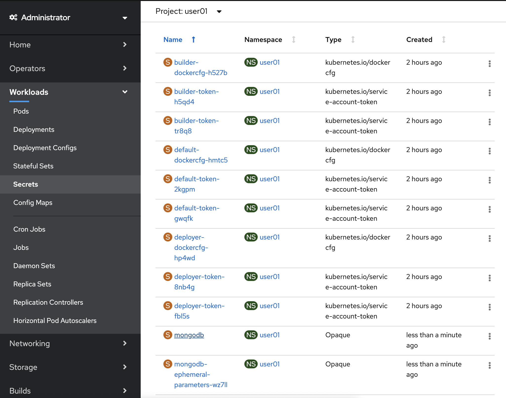
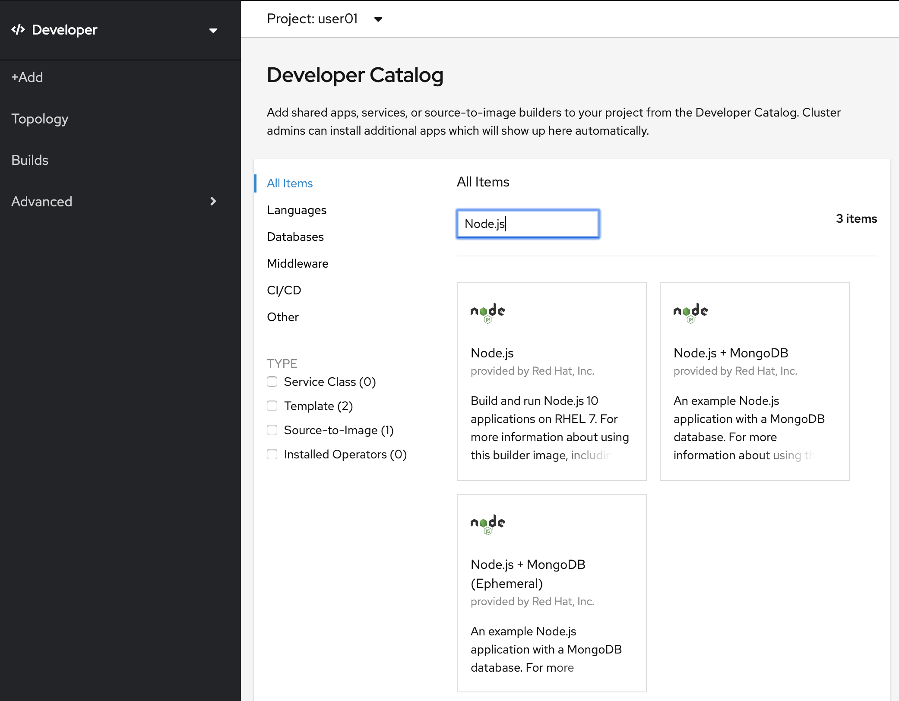
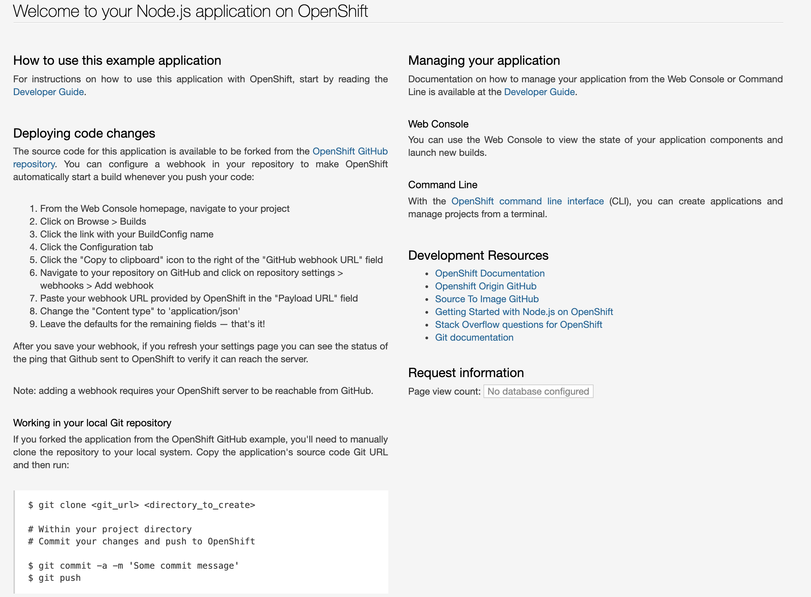

# 後半: 複数コンテナの連携

- テンプレートからMongoDBを構築
- テンプレートからNode.jsアプリケーションを作成
- Node.jsアプリケーションのsecretを設定し、MongoDBと繋げる

# MongoDBを構築
Node.jsアプリケーションを作成し、MongoDBと接続する上で必要な情報を設定し連携させます。まずはMongoDBから構築していきます。

1. プロジェクトを選択します

    プロジェクトは，**必ずご自身のログイン時のユーザー名 (例: "user01a")** のものを選択してください。
    Home > Project > user01a (例)

    

1. Catalog > Developer Catalog > と選択し、「mongodb (ephemeral)」と検索し、MongoDB(Ephemeral)を選択してください。

    

1. Create Service Instanceをクリックしたら下記のような画面になります。そのままCreateをクリックしてください。
  
    

1. 「Create Service Binding」を選択します。

    

1. 「Service Binding Name」が下記のように「mongodb-ephemeral」のようになっているはずなので、そのままCreateを選択してください。

    
    
1. 下記画面に遷移しますので、「SECRET」の「mongodb-ephemeral」のリンクを選択してください。(作成されるまで多少時間が掛かります)
  
  
  
1. 下にスクロールし、右側の「Reveal Values」を選択し、表示されたユーザー名やパスワード全てをメモしておいてください。後でアプリケーションの設定をする時に必要となります。

# Node.jsアプリケーションを構築

1. 次にNode.jsのアプリケーションを構築します。Catalog > Developer Catalog > Languages > JavaScript と進み、

   Node.jsを選択してください。(Node.js + MongoDBや、Node.js + MongoDB(Ephemeral)ではありません)

   

2. Create Applicationを選択したら、下記のように Nameは「ユーザー名-multi-pod-app」、Git Repositoryには

   「https://github.com/openshift/nodejs-ex.git」を入れ、Createを選択してください。

   

3. 次にアプリケーションへのRouteを作成します。Networking > Routes > Create Route と進み、

   Nameに「ユーザー名-multi-pod-app」、Service も同様に「ユーザー名-multi-pod-app」を選択、

   Target Port は「8080 -> 8080 (TCP)」を選択してCreateしてください。

   

4. Networking > Routes と進むと、今作成したRouteが表示されます。Locationのリンクを選択するとアプリケーションのデフォルトページに遷移します。右下の「Page view count」が「No database configured」になっていることを確認してください。

   

# Node.jsとMongoDBを繋げる

1. 最後に作成したNode.jsアプリケーションからMongoDBに接続する設定を行います。

   Deployment Configs > ユーザー名-multi-pod-app > Environment と進んでください。

   ここで Single values (env) の下にNAME, VALUEと入力できる箇所があるので、以前MongoDB構築時にメモした値を入れていきます。それぞれ下記のように入れていきます。

   NAME → VALUE

   MONGODB_USER → USERNAME

   MONGODB_DATABASE → DATABASE_NAME

   MONGODB_PASSWORD → PASSWORD

   MONGODB_ADMIN_PASSWORD → ADMIN_PASSWORD

   DATABASE_SERVICE_NAME → mongodb

   

2. 設定が終わったら、先ほどのアプリケーションのページに遷移してください。下記のようにPage view countが加算されるようになれば設定成功です。設定が反映されるまで時間がかかるので、うまくいかない場合はしばらくたってからリロードして確認してください。

   

