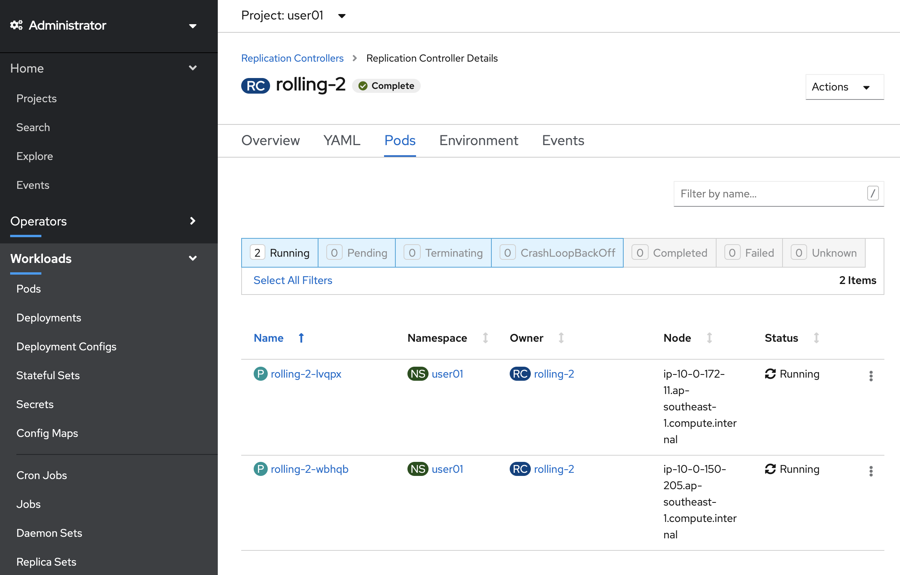

# Lab4: 様々なデプロイメント手法

- Blue Green Deployment
- Canary Deployment
- Rolling Deployment

# Blue Green Deployment
Blue Green Deploymentとは、異なるバージョンのアプリケーションを二つ作り、Load Balancer(OCPの場合はRouterが内部LBとして機能します) の向き先を変更することでアプリケーションのバージョンを切り替える手法です。Blueが現行バージョン、Greenが新バージョンです。

1. プロジェクトを選択します。

    ```
    $ oc login https://api.dev.ocp41.nosue.mobi:6443
    $ oc project ユーザー名 (ex. oc project dev01)
    ```

2. アプリケーション (Blue) を作成します。

    ```
    $ oc run blue --image=openshift/hello-openshift --replicas=2 --limits='cpu=500m,memory=128Mi'
    ```

3. 作成したアプリケーションのレスポンスを設定します。(このサンプルアプリケーションは環境変数によってレスポンスメッセージが設定可能になっています)

    ```
    $ oc set env dc/blue RESPONSE="Hello from Blue"
    ```

4. サービスを作成します。

    ```
    $ oc expose dc/blue --port=8080
    ```

5. サービスを外部公開します。

    ```
    $ oc expose svc/blue --name=bluegreen
    ```

6. 別バージョンのアプリケーション (Green) を作成します。

    ```
    $ oc run green --image=openshift/hello-openshift --replicas=2 --limits='cpu=500m,memory=128Mi'
    $ oc set env dc/green RESPONSE="Hello from Green"
    $ oc expose dc/green --port=8080
    ```

7. トラフィックをBlueに設定します。

    ```
    $ oc set route-backends bluegreen blue=100 green=0
    ```

8. 別のターミナルを開き、今どちらのアプリケーションに向いているのか確認します。

    ```
    $ oc get route bluegreen
    $ while true; do curl http://<oc get routeで取得したエンドポイント>; sleep .5; done
    
    Hello from Blue
    Hello from Blue
    Hello from Blue
    Hello from Blue
    Hello from Blue
    Hello from Blue
    
    ...
    ```

9. 今度はトラフィックをGreenに向けます。

    ```
    $ oc set route-backends bluegreen blue=0 green=100
    ```

10. 再びアクセスすると、別のバージョンに切り替わっていることが確認できます。

    ```
    $ oc get route bluegreen
    $ while true; do curl http://oc get routeで取得したエンドポイント; sleep .5; done
    
    Hello from Green
    Hello from Green
    Hello from Green
    Hello from Green
    Hello from Green
    Hello from Green
    ...
    ```

# Canary Deployment

Canary Deploymentは異なるバージョンのアプリケーションを二つ作り、トラフィックを少しずつ新しいバージョンへ流して、問題が無ければそのまま全て切り替える手法です。

1. プロジェクトを選択します。

   ```
   $ oc login https://api.dev.ocp41.nosue.mobi:6443
   $ oc project ユーザー名 (ex. oc project dev01)
   ```

2. アプリケーションを作成します。

   ```
   $ oc run prod --image=openshift/hello-openshift --replicas=2 --limits='cpu=500m,memory=128Mi'
   $ oc set env dc/prod RESPONSE="Hello from Prod"
   $ oc expose dc/prod --port=8080
   ```

3. サービスを作成します。

   ```
   $ oc expose svc/prod
   ```

4. 次に別バージョンのアプリケーションを作成します。

   ```
   $ oc run canary --image=openshift/hello-openshift --limits='cpu=500m,memory=128Mi'
   $ oc set env dc/canary RESPONSE="Hello from Canary"
   $ oc expose dc/canary --port=8080
   $ oc set route-backends prod prod=100 canary=0
   ```

5. 別のターミナルを開き、トラフィックが片方に寄っていることを確認します。

   ```
   $ oc get route prod
   $ while true; do curl http://<oc get routeで取得したエンドポイント>; sleep .5; done
   
   Hello from Prod
   Hello from Prod
   Hello from Prod
   Hello from Prod
   Hello from Prod
   ...
   ```

6. トラフィックの配分を変更します。

   ```
   $ oc set route-backends prod prod=90 canary=10
   ```

7. もう一度リクエストを送り、今度はトラフィックが分配されていることを確認します。

   ```
   $ oc get route prod
   $ while true; do curl http://oc get routeで取得したエンドポイント; sleep .5; done
   
   Hello from Prod
   Hello from Prod
   Hello from Prod
   Hello from Prod
   Hello from Prod
   Hello from Prod
   Hello from Prod
   Hello from Prod
   Hello from Prod
   Hello from Prod
   Hello from Canary
   Hello from Prod
   Hello from Prod
   ...
   ```

# Rolling Update

Rolling Updateは新しいバージョンのアプリケーションのPodを少しずつ増やし、古いバージョンのアプリケーションのPodを少しずつ減らして入れ替えていく手法です。

1. プロジェクトを選択します。

   ```
   $ oc login https://api.dev.ocp41.nosue.mobi:6443
   $ oc project ユーザー名 (ex. oc project dev11)
   ```

2. アプリケーションを作成します。

   ```
   $ oc run rolling --image=openshift/hello-openshift --replicas=2 --limits='cpu=500m,memory=128Mi'
   $ oc expose dc/rolling --port 8080
   $ oc expose svc/rolling
   ```

3. アプリケーションから返されるレスポンスを設定します。

   ```
   $ oc set env dc/rolling RESPONSE="Hello from new roll"
   ```

4. Workloads > Deployment Configs > rolling > Podsを確認します。

   

5. 別のターミナルを開き、レスポンスを確認します。

   ```
   $ oc get route rolling
   $ while true; do curl http://<oc get routeで取得したエンドポイント>; sleep .5; done
   
   Hello from new roll
   Hello from new roll
   Hello from new roll
   ...
   ```

6. レスポンスを変更します。

   ```
   $ oc set env dc/rolling RESPONSE="Hello from second roll"
   ```

7. 再度レスポンスを確認し、変更されていることを確認します。

   ```
   $ oc get route rolling
   $ while true; do curl http://oc get routeで取得したエンドポイント; sleep .5; done
   
   Hello from second roll
   Hello from second roll
   Hello from second roll
   ...
   ```

8. Workloads > Deployment Configs > rolling > Podsを再度確認し、Pod名が変わっていることを確認します。

   

   