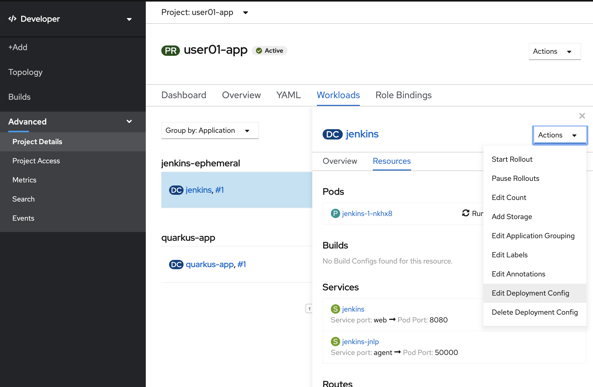

# Lab6: Jenkinsベースのビルドパイプラインへの組込

- Jenkins CI/CDパイプライン構築
- 応用問題

# Jenkins CI/CDパイプライン構築
Lab5で作成したQuarkusプロジェクトをjenkinsベースのビルドパイプラインへ組み込み、jenkins上でビルド、デプロイできるようにします。前回のLab5では御自身で様々なコマンドを打ち込みBuild Configを作成したり、アプリケーションを手動で作成したりしていました。ここではjenkins pipelineという仕組みを使って一連の手順を自動化します。

1. CodeReady 上でterminalを開き、Lab5で作成したjenkinsプロジェクトを選択してください。

   ex. oc project devXX-app   

   また、カレントディレクトリが「sample-quarkus-0.20.0」であることも確認してください。

2. jenkinsをprojectにインストールします。

    ```
    oc new-app jenkins-ephemeral
    ```

3. Jenkinsのメモリ上限を増やします。openshiftコンソールから

    Workloads > Deployment Configs > jenkins > YAML と選び、下記画像のようにspec.template.spec.containers.resources.limiits.memoryを2Giに変更してsaveしてください。

    

4. Lab5で作成したBuild Config等を削除して作り直していきます。下記でApplicatoinの設定を全て削除します。(Hands-on中にproject内にゴミが溜まってうまく動かなくなった場合も、下記でApplicatoin設定を削除してみてください)

    ```
    ./openshift/delete-quarkus-app.sh
    ```

5. 下記コマンドを入力し、Build Config を作成します。

    ```
    oc create -f openshift/pipeline.yaml
    ```

6. 作成したBuild Config をstart します。これだけでjenkins上で一連の流れがスタートします。

    ```
    oc start-build quarkus-sample-pipeline
    ```

7. jenkinsの画面を開き、pipelineが開始されていることを確認します。

    ```
    $ oc get route
    出力結果のLocation情報をコピーしてブラウザで確認します
    ```

    OCPのログイン情報を使用してJenkinsのUIにログインします

    

    users.htpasswdを選択し，その後ログイン情報を入力します(例: dev01/openshift)

    

    **自身のプロジェクト名** を選択します(例: dev01-app)

    

    **プロジェクト名/パイプライン名** を選択します (例: dev01-app/quarkus-sample-pipeline)

    

    時間経過とともにパイプラインのステージがだんだん右側に伸びていくことが確認できます

8. 左下の #1を選択し、次の画面でConsole Outputを選択してください。pipeline実行中のログが確認できます。

    

9. 下記のような出力が確認できればpipeline は完了です。前回と同じ手順でquarkusアプリケーションのエンドポイントを確認し、画面が表示されているか確認してください。

    

    

10. 下記のようにデフォルトページが表示されれば完了です。

    

# 応用問題

1. openshift/pipeline.yaml 開き、各stageが定義されていることを確認してください。ここに任意の箇所で下記stageを追加してください。

   ```
   stage('Test Stage') {
       steps {
           script {
               openshift.withCluster() {
                   openshift.withProject() {
                       echo "Test Stage !!!!"
                   }
               }
           }
       }
   }
   ```

   編集したら下記で変更したpipelineを適用します。その後再度jenkins上で「Build Now」を選択してpipelineを開始し、出力がどのように変化するか確認してください。

   ```
   oc apply -f openshift/pipeline.yaml
   ```

2. importしたgithubプロジェクトの 「src/main/java/org/acme/quickstart/GreetingResource.java」の出力を変更、pushした後jenkins上で再度「Build Now」を実行してください。pipeline完了後、/hello エンドポイントの出力が変わっているか確認してください。