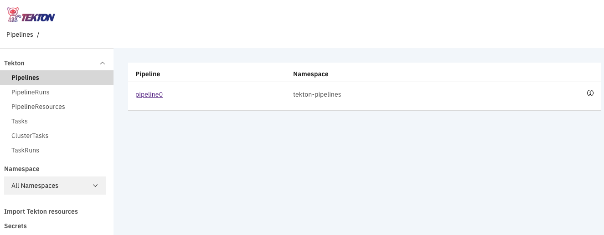
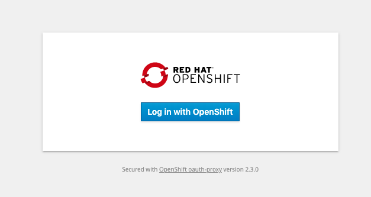
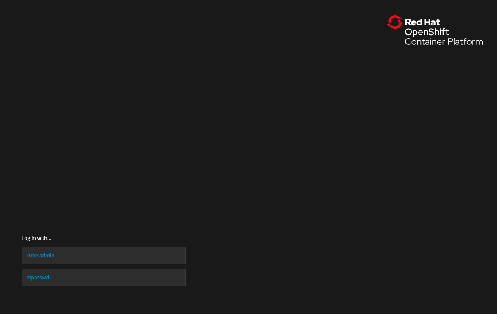
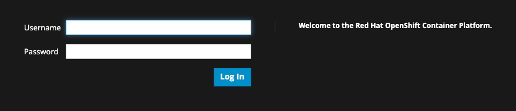
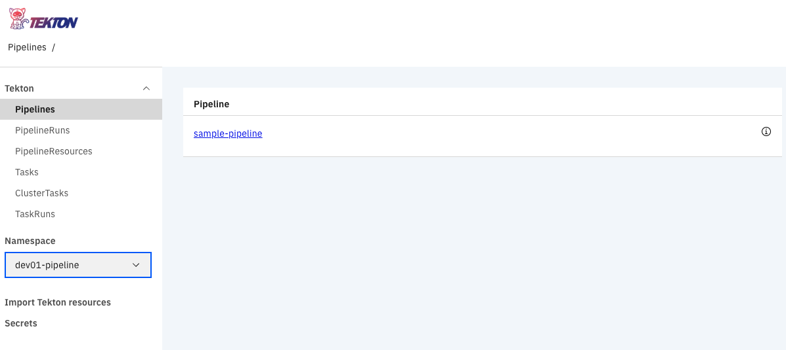
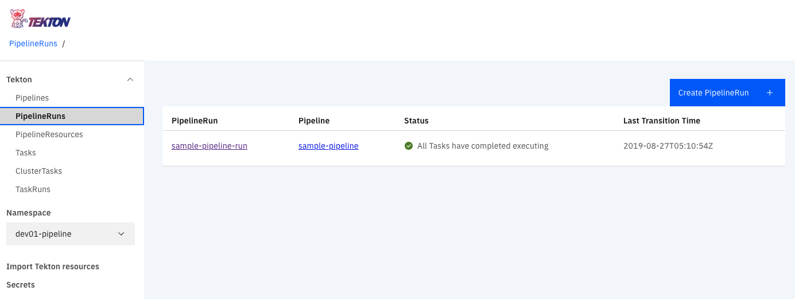
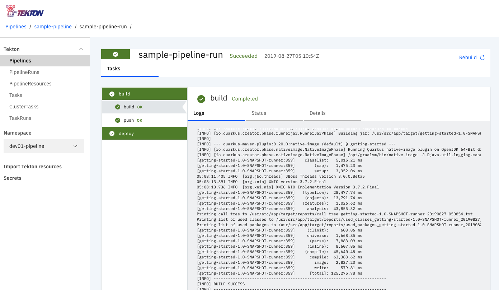
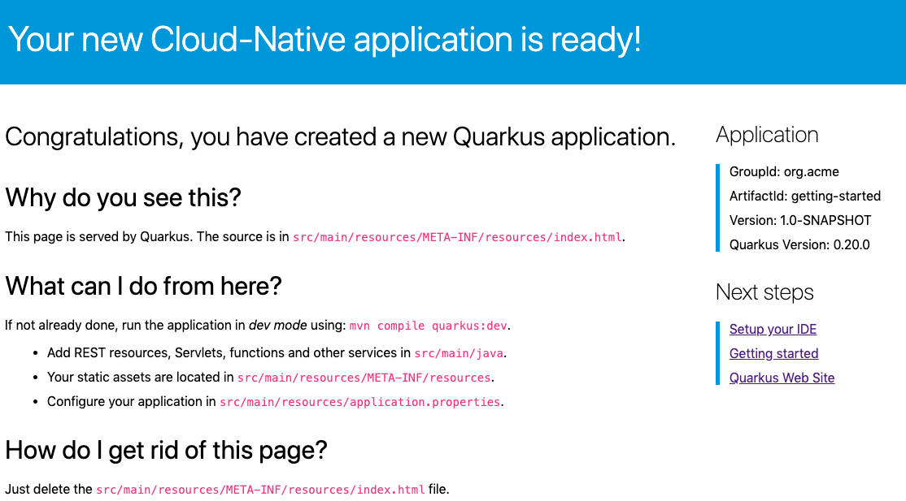
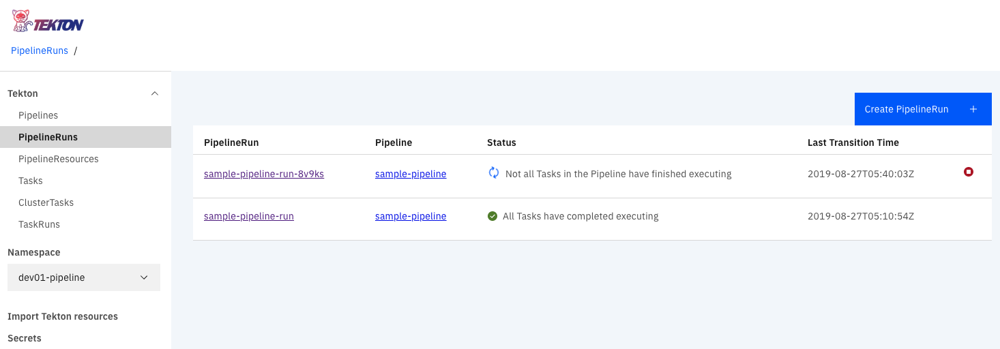

# Lab7: Tektonを使ったパイプラインの構築

-  インストール
- TektonでCI/CD構築

# Tekton インストール

Lab5で作成したQuarkusプロジェクトをTektonベースのビルドパイプラインへ組み込み、Tekton上でビルド、デプロイできるようにします。Tektonはkubernetes nativeなパイプラインツールで、現在盛んに開発が進められています。

1. 下記でTekton Pipelineをインストールします。

   ```
   oc new-project tekton-pipelines
   oc adm policy add-scc-to-user anyuid -z tekton-pipelines-controller
   oc apply --filename https://storage.googleapis.com/tekton-releases/latest/release.yaml
   oc get pods --namespace tekton-pipelines --watch
   ```

2. 続けて下記でTekton dashboardをインストールします。

   ```
   oc apply -n tekton-pipelines --filename https://github.com/tektoncd/dashboard/releases/download/v0.1.0/openshift-tekton-dashboard.yaml
   ```

3. Routeを確認し、ログイン画面が表示されたらOpenshift と同じユーザー情報を入力してログインできればインストール完了です。

   

# TektonでCI/CD構築

1. Lab5でimportしたprojectにtektonというディレクトリがあるので移動してください。

   ```
   cd tekton
   ```
   
2. pipelineで必要な設定をするために、下記でセットアップを行います。ユーザー名の箇所には御自身のユーザー名を入力してください。 ex. dev01

   ```
   sed -i -e 's/pipeline-test/ユーザー名-pipeline/g' setup.sh
   sed -i -e 's/pipeline-test/ユーザー名-pipeline/g' application.yaml
   sed -i -e 's/pipeline-test/ユーザー名-pipeline/g' pipeline-resources.yaml
   ./setup.sh
   ```

3. 続けて下記でpipelineをスタートします。

   ```
   ./start-pipeline.sh
   ```

4. dashboardでpipelineの状況を確認する為にTektonのURLをブラウザバーに入力します。表示したら「Log in with OpenShift」を選択します。

   

5. 下のhtpasswdを選択します。

   

6. ご自身のユーザー名、パスワードを入力して進みます。

   

7. 途中で SSO許可の画面が表示されますので、「Allow Permission」としてください。tektonの画面にログインできたら、左下のNamespacesで御自身のプロジェクトを選択してください。

   

8. PipelineRunsを選択すると作成したPipelineの状態が確認できます。sample-pipeline-runを選択してください。

   

9. pipelineの詳細が確認できます。build, deploy共にグリーンになっていたら成功です。Routeを確認してデプロイしたアプリケーションにアクセスしてください。

   

10. アプリケーションの画面が表示できれば成功です。

   

# 応用問題

ここからは応用問題です。tektonには専用のcliが用意されています。下記より環境に合わせてダウンロードし、応用問題に記載されている各種コマンドを試してみてください。

https://github.com/tektoncd/cli 

1. 下記コマンドを打ってpipelineを詳細を確認してみてください。出力がサンプルの用に表示されるか確認してみてください。

   ```
   $tkn pipeline describe sample-pipeline
    
   Name:   sample-pipeline
   
   Resources
   NAME         TYPE
   app-source   git
   app-image    image
   
   Tasks
   NAME     TASKREF          RUNAFTER
   build    build-and-push   []
   deploy   oc               [build]
   
   Runs
   NAME                  STARTED          DURATION    STATUS
   sample-pipeline-run   33 minutes ago   7 minutes   Succeeded
   ```

2. tknを使って最後に実行したpipelineの設定で、再度流し直すことができます。下記で再実行し、pipelineの状態を確認してください。下記画像のように新しくpipelinerunが作成されていたら成功です。

   ```
   tkn pipeline start sample-pipeline -l
   ```

   