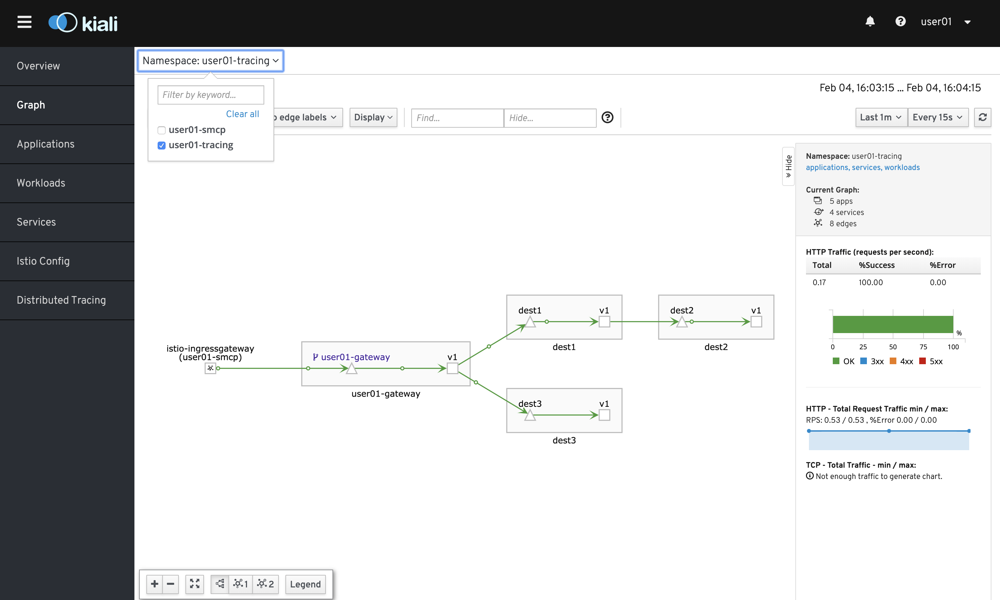
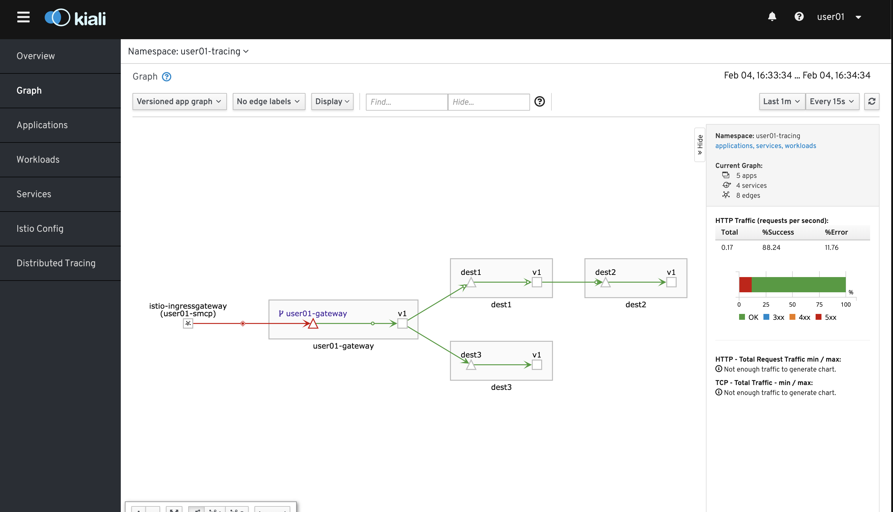
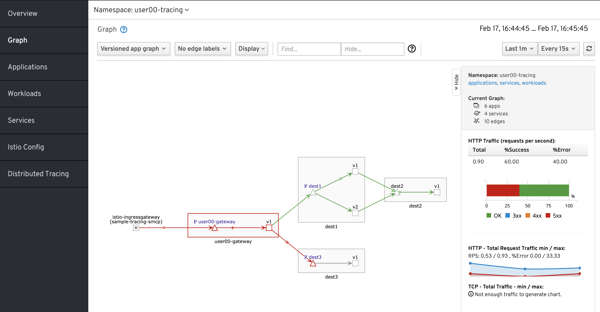
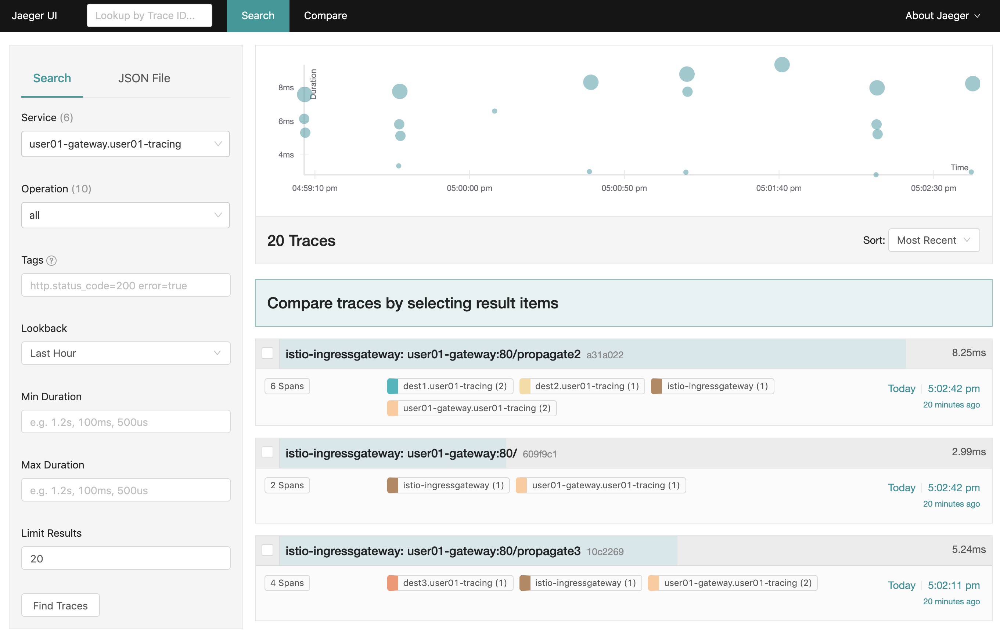

# Lab8: Service Meshを使ったアプリケーション開発

- Service Mesh上にアプリケーションを構築
- Service Meshを使ったfault injection
- Service Meshを使ったCanary Deployment

# Service Mesh上にアプリケーションを構築

Service Mesh上にアプリケーションを構築していきます。  Service MeshにはOpenShift Service Meshを使用します。 
https://docs.openshift.com/container-platform/4.2/service_mesh/service_mesh_arch/understanding-ossm.html

CodeReadyを使用している場合はCodeReadyのTerminal、踏み台サーバーを使用している場合は踏み台上で作業を行なってください。また、OpenShfitにログインしているかどうか確認してください。ログインしていない場合は下記でログインができます。

```
oc login https://api.xxx:6443
```

1. 作業ディレクトリに移動し   
(CodeReady Workspaceで作業する場合は「/projects」配下, 踏み台の場合は「/home/userxx」)   
プロジェクトをcloneしてください。

  ```
  git clone https://github.com/16yuki0702/tracing-app.git
  ```

2. アプリケーションで必要な設定をするために、下記でセットアップを行います。ユーザー名の箇所には御自身のユーザー名を入力してください。 ex. user01

   ```
   cd tracing-app
   ./setup.sh ユーザー名
   ```
   
3. 続けて下記でアプリケーションのビルド, デプロイを行います。

   ```
   ./build.sh
   ./deploy.sh
   ```

4. 下記を実行してアプリケーションにリクエストを送ります。

   ```
   ./test.sh
   ```

5. kialiのダッシュボードを確認してアプリケーションの状況を確認します。下記でURLを確認し、頭にhttpsをつけてブラウザから遷移してください。

   ```
   oc get route kiali --template='{{ .spec.host }}' -n ユーザー名-smcp
   ```

6. SSOを求められたら、OCPログイン時と同じ ユーザー名/パスワード を入力してください。ダッシュボードに遷移したら、下記画像の様に「Namespace」に ユーザー名-tracingを選択し、「DIsplay」ボタンを押してTraffic Animationにチェックを入れてください。リクエストの状況がアニメーションで確認できます。

   

# Service Meshを使ったfault injection

1. 下記でfault injectionの設定をapplyします。

   ```
   oc apply -f dest3/fault-injection.yaml
   ```
   
2. ダッシュボードを確認し、リクエストが失敗する時としない時があることを確認してください。

   

# Service Meshを使ったCanary Deployment

1. 下記でCanary Deploymentの設定をapplyします。

   ```
   oc apply -f dest1/canary.yaml
   ```

2. ダッシュボードを確認し、dest1のv1とv2にトラフィックが送られるようになったことを確認してください。また、レスポンスに「Hello from dest1-v1!!」「Hello from dest1-v2!!」が交互に表示されることを確認してください。

   

# 応用問題

Tracingをより詳細に確認できるJaegerというアプリケーションも今回のハンズオンで用意されています。URLを調べてJaegerのダッシュボードを確認し、Tracingがどのように表示されるか確認してみてください。

