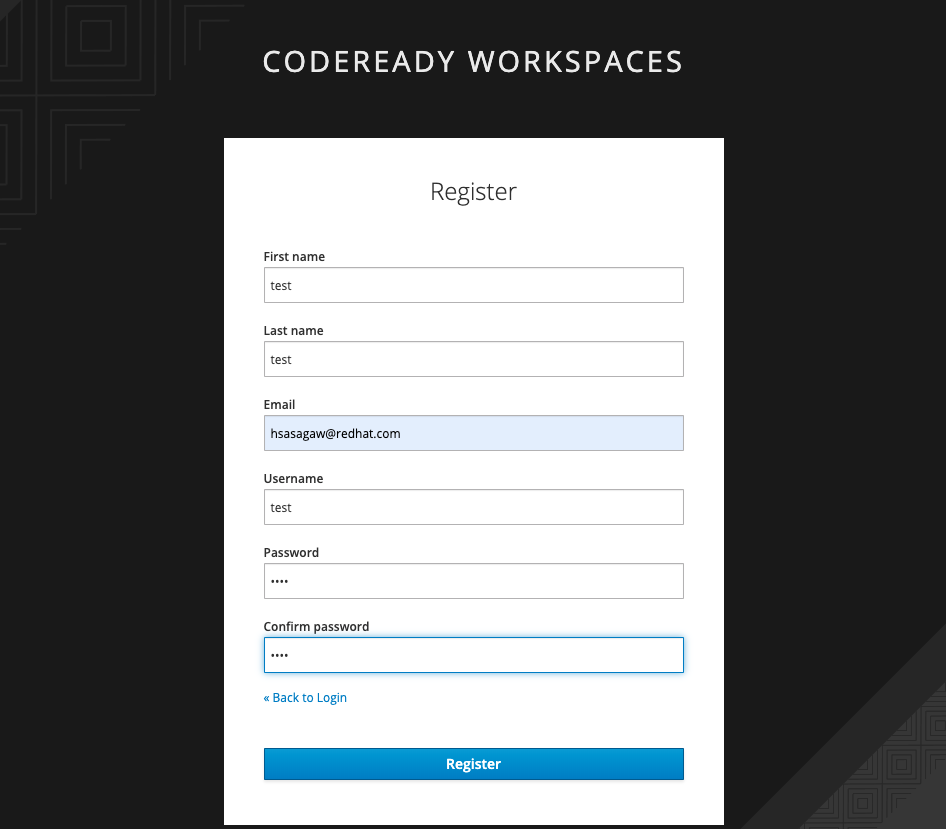
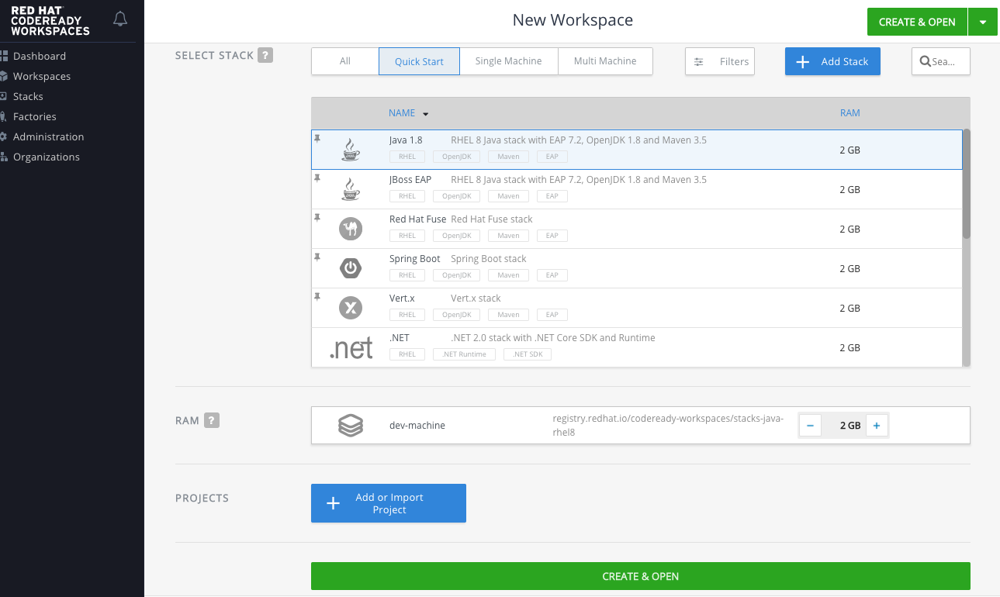
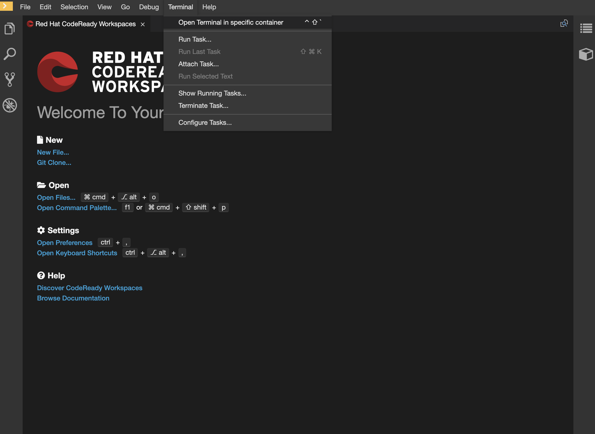

# Setup Workspace

Hands-on 作業用にocクライアントが入った開発環境を用意します。

1. 指定されたCodeReady WorkspaceのURLを開いてください。ログイン画面が表示されますので、Registerを選択してアカウントを作成します。

   
   
12. 御自身のユーザー名 (ex. dev01) を入力してRegisterを選択してください。Email, Password等は任意です。

    

13. 下記のような画面が表示されたらCodeReadyにログイン完了です。Java1.8を選択して 「CREATE & OPEN」を選択してください。WorkSpaceの作成が始まります。時間がかかるのでしばらくお待ちください。

    
    
4. 下記画面が開いたら Workspaceの作成完了です。 Run > Terminal でターミナルが開きます。 (セッションが切れて固まった場合は都度ターミナルを開き直してください) Hands-onで必要なコマンドは以降こちらで入力できます。

   

